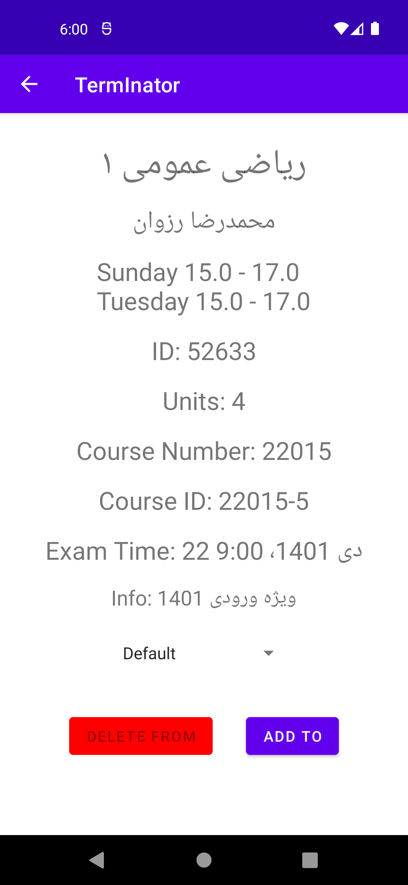
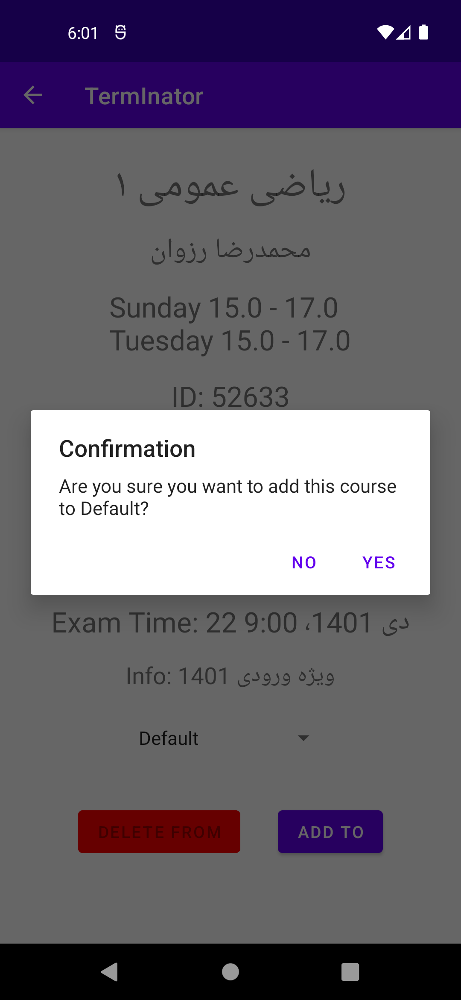
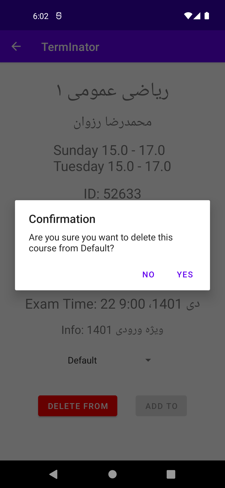

# mobile-homework-1

**Mobile Programming Course Homework 1**

**Parsa Mohammadian - 98102284**

**Sara Azarnoush - 98170668**

Fall 2022

## Introduction
This app is an implementation of [term.inator.ir](http://term.inator.ir/) website in Android.
TermInator is a website that provides a list of courses and their information for students of Sharif University of Technology.
Students can also view their courses in a calendar view.

## Technical Details
This app is written in Java and uses [Android Studio](https://developer.android.com/studio) as the IDE.

It uses [Gson](https://github.com/google/gson) library for parsing courses JSON file which 
are in `assets/courses` directory. 

The main activity which is `MainActivity` consists of a `CoursesFragment` and a `AgendaFragment` and a `BottomNavigationView` for switching between them.
`RecyclerView` is used for implementation in both fragments.

There is also a `CourseActivity` which is used for showing the details of a course when a course is clicked in `CoursesFragment` or `AgendaFragment`. 
This activity has two buttons for adding and removing a course from the agenda.

Agenda data is stored in SQLite database and persists between application launches.

## Screenshots
. | . | .
:-:|:-:|:-:
||
||
